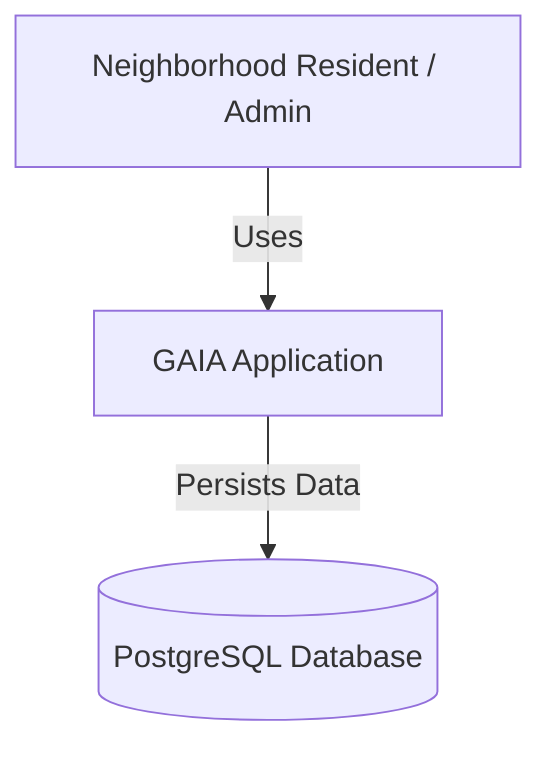
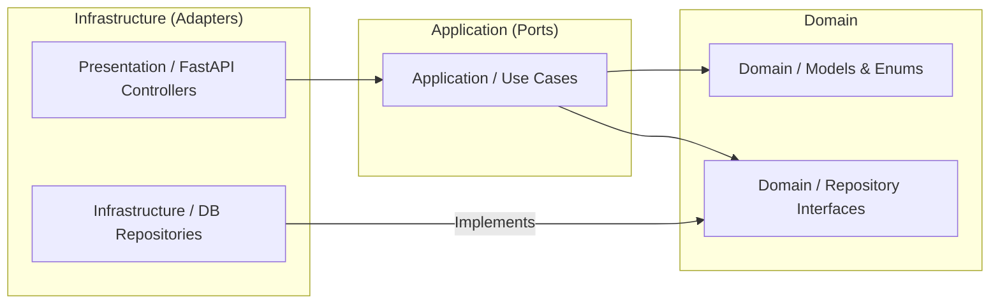

# Architectural Model

This document describes the high-level architecture of the GAIA application using the C4 model.

## System Context Diagram

## Component Diagram (Backend)

The backend follows a **Hexagonal Architecture** (Ports and Adapters).

## Data Flow: Create News Draft
1. **Presentation**: `POST /api/v1/news_articles` receives `NewsCreate` schema.
2. **Application**: `CreateNews` use case sanitizes HTML and invokes repository.
3. **Infrastructure**: `NewsRepositoryImpl` persists the `News` entity to PostgreSQL.
