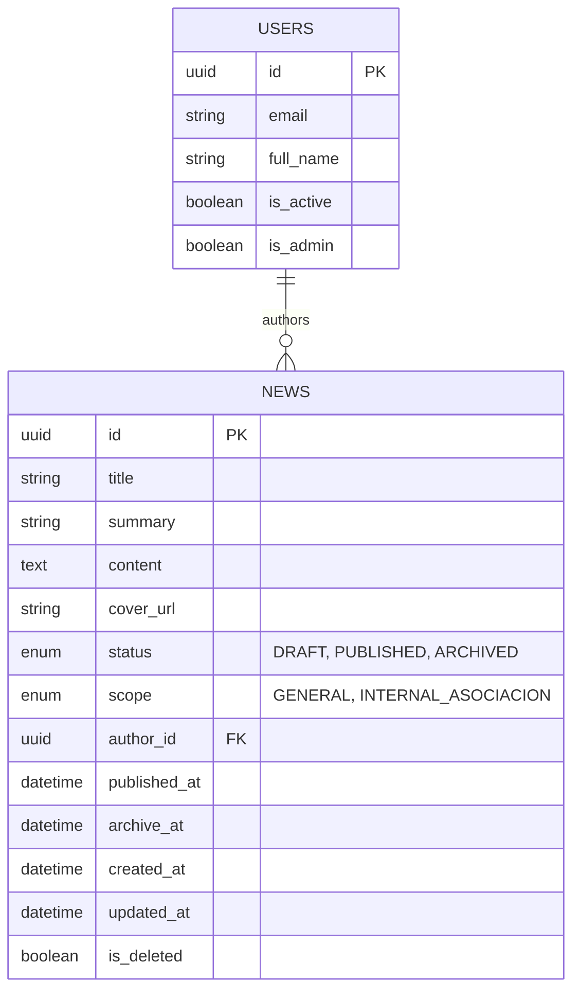

# Data Model

## Conceptual ER Diagram

## Entities

### News
Represents a news article or announcement.
- **id**: Unique identifier.
- **scope**: Controls visibility (General vs Internal Members).
- **status**: Publishing workflow state.
- **author_id**: Link to the User who created it.
- **is_deleted**: Soft-delete flag.

### User
Represents an application user (Neighbor/Board Member).
- **id**: Unique identifier.
- **email**: Contact and login identifier.
- **is_admin**: Whether the user has administrative privileges.
